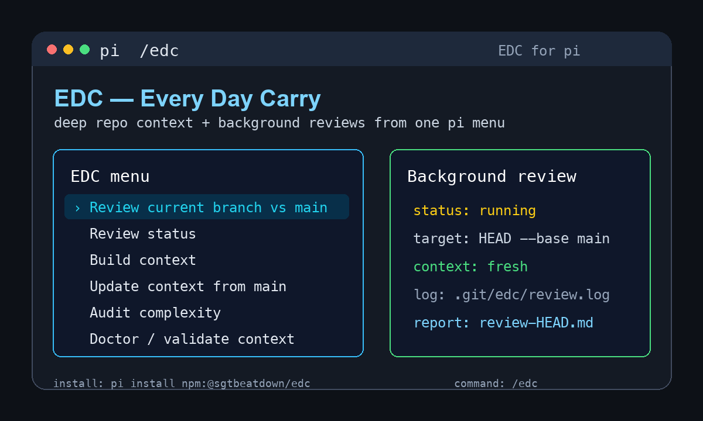

# EDC — Every Day Carry Skills

Deep codebase understanding and context-aware review for AI coding agents. EDC builds a persistent `edc-context/` map of a repository, then uses that map for focused reviews, audits, and context loading.

Works with **Claude Code**, **Cursor**, **Codex**, and **pi**.



## What EDC Does

EDC separates deterministic orchestration from LLM analysis:

- Shell scripts own routing, freshness checks, manifest updates, subprocess spawning, and validation.
- Subagents write per-module architecture context and review reports.
- Agent integrations expose the same workflows through native commands, skills, hooks, or pi's interactive menu.

The generated context lives in the target repository under `edc-context/`. Build it once per repo, then update it when the code moves.

### Commands

| Command | When to run it |
|---------|----------------|
| **build** | Once per repo, and after big refactors. Discovers modules and writes `edc-context/{index.md, manifest.json, modules/*.md, reports/*, build/build.json}` plus a short `AGENTS.md` orientation. |
| **update** | Before review/audit if HEAD has moved. Incremental refresh from a branch diff so you do not rebuild from scratch on every PR. |
| **review** | On a PR, branch, commit, or diff file. Runs context-aware differential review and writes a consolidated `review-*.md` report. |
| **audit** | Anytime. Compares context expectations against actual code to flag overengineering, bloat, duplication, and dead exports. |
| **doctor** | When something feels off. Validates the `edc-context/` tree and routing contract. |
| **mode** | Shows or toggles runtime context loading mode (`advisory` or `inject`). |

### Terminal CLI

Every installer places a shared terminal wrapper at `~/.edc/scripts/edc` alongside the orchestrator scripts. From any terminal, in the target repo:

```bash
# build or update context in the current repo
edc build  --agent claude
edc build  --agent cursor --force
edc build  --agent codex --focus orchestrator
edc build  --agent codex --ignore 'vendor/**' --ignore 'dist/**'
edc update --agent claude              # incremental refresh after HEAD moves

# run the review pipeline in the current repo
edc review --agent claude --base main
edc review --agent cursor HEAD --base main
edc review --agent codex --pr 42
edc review --agent pi HEAD --base main
edc review --agent codex https://github.com/owner/repo/pull/42
edc review --agent codex HEAD --base main --ignore 'generated/**'

# complexity / bloat / duplication audit
edc audit  --agent claude
edc audit  --agent pi

# runtime-mode toggle (used by Claude Code and pi inject/advisory hooks)
edc mode                # show current mode
edc mode advisory       # docs only, hooks no-op
edc mode inject         # auto-load context through supported hooks

# validate the edc-context/ layout
edc doctor
```

`--agent` selects which CLI (`claude` / `cursor` / `codex` / `pi`) drives subprocess fanout, and is mandatory for `build`, `update`, `review`, and `audit` (not for `mode` or `doctor`). `review` and `audit` auto-build or auto-update `edc-context/` first if it is missing or stale. Review routes changed files through `edc-context/manifest.json`: module-mapped files get module context, unexpected unmapped files are reviewed with repo-level context only, and paths matching `unmapped.allowedGlobs` are intentionally skipped but listed in the final review. `--ignore` may be repeated; passing any `--ignore` flag overrides `.edcignore` for that run, otherwise `.edcignore` is read from the repo root.

## Install

### Claude Code

Recommended — install via the plugin marketplace:

```bash
claude plugin marketplace add almogdepaz/edc
claude plugin install edc@edc
```

Alternative — install the runtime directly from a clone:

```bash
bash install.sh --agent claude
```

Both paths install the plugin surface (slash commands + hooks + skills) and the terminal CLI (`~/.edc/scripts/edc`).

### Cursor

```bash
# remote one-liner
curl -fsSL https://raw.githubusercontent.com/almogdepaz/edc/main/install.sh | bash -s cursor

# or from a local checkout
bash install.sh --agent cursor
```

### Codex

```bash
# remote one-liner
curl -fsSL https://raw.githubusercontent.com/almogdepaz/edc/main/install.sh | bash -s codex

# or from a local checkout
bash install.sh --agent codex
```

### pi

```bash
# npm package
pi install npm:@sgtbeatdown/edc

# project-local install for a team repo
pi install npm:@sgtbeatdown/edc -l

# git install works for pinned refs or source installs
pi install git:github.com/almogdepaz/edc
pi install git:github.com/almogdepaz/edc@v1.1.1

# list/update/remove through pi
pi list
pi update npm:@sgtbeatdown/edc
pi remove npm:@sgtbeatdown/edc

# or via the unified installer
bash install.sh --agent pi
```

Pi exposes one interactive `/edc` menu inside pi: review current branch vs `main`, job status, build, update, audit, doctor, and cancel. Review/build/update/audit actions run in the background through one shared job slot; current job status is written to `.git/edc/status` and raw logs to `.git/edc/<kind>.log`. Job status reports classified failure reasons when possible, including HEAD movement during the run and incomplete context recovery. Pi also exposes the human-facing `edc-review` and `edc-audit` skills for ad hoc methodology use; internal build/update/context prompt bundles stay hidden from pi autocomplete. See [`pi/README.md`](pi/README.md).

Quick pi path:

1. Install EDC with `pi install npm:@sgtbeatdown/edc`.
2. Start `pi` in a git repository.
3. Run `/edc` and choose **Build context** once.
4. Run `/edc` → **Review current branch vs main**.
5. Poll `/edc` → **Job status** while the background job runs.

All installers also drop the shared terminal CLI and orchestrator scripts under `~/.edc/scripts/` so `edc build|update|review|audit|mode|doctor` works from any shell after that directory is on `PATH`.

#### Codex auth with the orchestrator

The orchestrator spawns `codex exec` subprocesses under an isolated `CODEX_HOME` (a fresh temp dir per run) so pipeline state never collides with your interactive Codex sessions. That isolation also means subprocesses do not inherit your Codex login.

If `codex exec` fails with an auth error inside the pipeline, point the orchestrator at your real Codex home before invoking EDC:

```bash
export EDC_CODEX_HOME="$HOME/.codex"
```

When `EDC_CODEX_HOME` is set, the orchestrator uses it verbatim and does not clean it up.

## Agent Commands and Menus

Claude, Cursor, and Codex expose thin wrappers for the same deterministic orchestrators. Pi exposes the workflows through one interactive `/edc` menu instead of separate slash commands.

| Agent | User-facing actions |
|-------|---------------------|
| Claude Code | `/edc:edc-build`, `/edc:edc-update`, `/edc:edc-run-review`, `/edc:edc-doctor`; methodology skills `edc-review`, `edc-audit` |
| Cursor | `/edc-build`, `/edc-update`, `/edc-run-review`, `/edc-doctor`; public methodology skills |
| Codex | `$edc-build`, `$edc-update`, `$edc-run-review`, `$edc-doctor`; public methodology skills |
| pi | `/edc` interactive menu: review/status/build/update/audit/doctor; methodology skills `edc-review`, `edc-audit` |

### Review invocation examples

```bash
# terminal CLI
edc review --agent claude --pr 42
edc review --agent codex https://github.com/owner/repo/pull/42
edc review --agent pi HEAD --base main
edc review --agent claude abc1234                 # single commit; base defaults to abc1234^
edc review --agent claude HEAD --base HEAD~5      # commit range
edc review --agent claude path/to/changes.patch   # pre-generated diff file
edc review --agent claude --pr 42 --base main --ignore-context

# Claude slash command equivalent
/edc:edc-run-review --pr 42
/edc:edc-run-review HEAD --base main
/edc:edc-run-review path/to/changes.patch
```

Without `--base`, a git ref target uses its parent (`<target>^`) as the base, which reviews only that commit. To review a branch against `main`, pass `--base main`. For PR targets, EDC uses `gh pr diff <number-or-url> --name-only`, so `gh` must be installed and authenticated. Use `--ignore-context` for a pure direct review with no context build/update and no reads from existing `edc-context/`; use `--no-context-refresh` to skip creation/update while still allowing existing context if present.

## Runtime Modes

EDC stores runtime mode in `edc-context/manifest.json` as `policy.defaultMode`.

- **`advisory`** (default) — pure docs. Hooks no-op. Agents read `edc-context/index.md` and relevant `edc-context/modules/<name>.md` when prompted by a command/menu or by the user. Zero token overhead per tool call.
- **`inject`** — auto-loaded context for supported integrations. Session start surfaces `edc-context/index.md`; before `Edit`/`Write`/`Bash`/tool-call paths, EDC resolves the file through `manifest.json` and injects the matching module doc once per session.

Toggle from a target repo after context exists:

```bash
edc mode
edc mode advisory
edc mode inject
```

Cursor and Codex are docs-only regardless of the mode flag. Claude Code and pi support injection.

## Pi Package Compatibility

EDC is intentionally conservative as a pi package: it registers one `/edc` command, does not override built-in tools, and exposes only the `edc-review` and `edc-audit` skills. Provider packages such as Cursor/Anthropic OAuth extensions should coexist normally.

Known interactions:

- Context-pruning packages can be used with EDC. Prefer EDC's default `advisory` mode for maximum compatibility; `inject` mode intentionally adds EDC context messages to the session.
- Permission, plan-mode, sandbox, SSH, or protected-path extensions may block or redirect EDC's `bash`, `edit`, and `write` activity. That is expected. EDC build/update/audit/review needs shell access plus write access to `AGENTS.md`, `edc-context/`, `.edc/`, `.git/edc/`, and `review-*.md`.
- EDC's pi subprocesses require `pi`, `git`, `jq`, `python3`, and Bash >= 4. On macOS, install modern Bash with Homebrew if `/bin/bash` is 3.2.
- Nested pi subprocesses receive the active pi model through `EDC_PI_MODEL` when pi exposes `ctx.model.provider` and `ctx.model.id`; check `.git/edc/<kind>.log` if provider/model propagation looks wrong.

## Generated Files and Local State

EDC writes generated context and local runtime state in a few places:

- `edc-context/` — generated per-module deep context written by build/update; review task IPC lives under `edc-context/review-tasks/`. This directory is disposable: recovery may wipe and rebuild it.
- `AGENTS.md` — short generated orientation pointing agents at `edc-context/`.
- `review-*.md` — consolidated review output.
- `.edc/` — project-local runtime copy used by hooks/extensions when they need deterministic access to orchestrator scripts and private prompt bundles. Global installs also live under `~/.edc/`.
- `.git/edc/status` and `.git/edc/<kind>.log` — pi's current background job status/logs. These are git metadata files, not worktree files, and need no `.gitignore` entry.

For repos where you do not want generated EDC artifacts tracked, add:

```gitignore
AGENTS.md
edc-context/
review-*.md
.edc/
```

If generated context or review outputs get committed, `edc review` filters them out of diffs automatically so the tool does not review its own output, but you will still usually want them ignored to keep history clean.

## Repo Structure

```
edc/
  install.sh                           # one-line installer for all agents
  AGENTS.md                            # generated agent entrypoint/orientation
  .claude-plugin/marketplace.json      # Claude plugin marketplace manifest
  plugins/edc/                         # plugin, skills, hooks, and shared orchestrators
    commands/                          # user-facing Claude slash commands
    skills/                            # user-facing methodology skills
    prompt-bundles/                    # hidden prompt bundles for orchestrator subprocesses
    scripts/                           # everything that ships to ~/.edc/scripts/
    hooks/                             # Claude hook surface + shared JS runtime helpers
  pi/                                  # pi package surface, docs, extension, and installer
  tests/hardening/                     # shell/Node regression tests
  benchmark/                           # CVE recall and review benchmark harnesses
```

Cursor and Codex have no in-repo runtime source beyond installer templates. Their wrappers are emitted by `install.sh` into `~/.cursor/commands/` and `~/.codex/skills/`, and delegate to the orchestrators under `~/.edc/scripts/`.

For implementation details, see [`plugins/edc/README.md`](plugins/edc/README.md). For generated architecture context, see [`edc-context/index.md`](edc-context/index.md) after running `edc build`.
